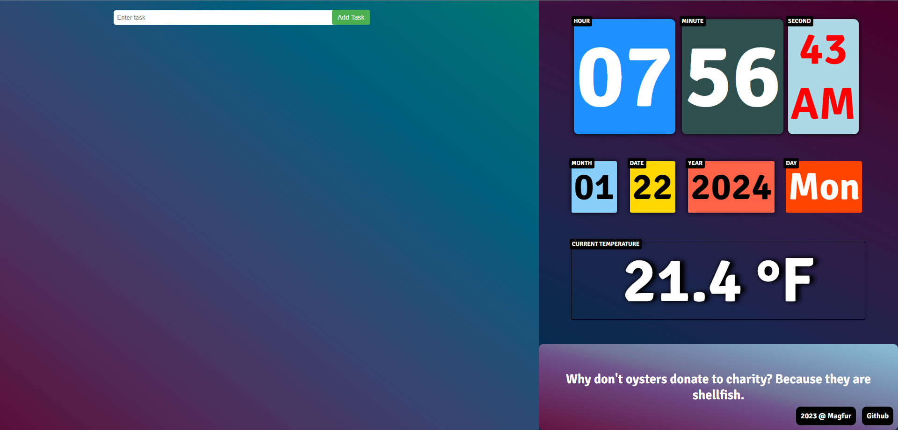

# InspireTask

## Features

### Task List Management

- Users can add tasks to a list.
- Each task includes a description, a "Delete" button, an "Edit" button, and a checkbox to mark it as completed.
- Tasks are stored in the browser's local storage, allowing them to persist even if the page is refreshed.

### Time and Date Display

- The application displays the current time and date.
- The time is shown in a 12-hour format with hours, minutes, seconds, and an AM/PM indicator.
- The date is presented with the day, month, and year, along with the name of the weekday.

### Random Quote Display

- The application fetches a random quote from a JSON file (`data.json`) using the Fetch API.
- The quote is displayed on the webpage and updates every 5 mini.

### Weather forecast

- Fetches a day weather forecast using the [Open Meteo API](https://open-meteo.com/).
- The Open-Meteo APIs are free for non-commercial usage. Please be mindful that user daily requests remain below 10,000. In addition, Open-Meteo has the right to restrict programs and IP addresses that abuse our service.

### User Interaction

- Users can edit task descriptions by clicking the "Edit" button, prompting them with a dialog to enter a new task description.
- Completed tasks can be marked using checkboxes, and their status is stored in local storage.
- Users can delete tasks, removing them from both the webpage and local storage.

### Styling

- The application features basic styling for a pleasant user interface.
- Delete and Edit buttons are styled with specific colors and hover effects.
- Time and date elements are styled and updated every second.

## Desktop app

1. Download the [app.exe](https://github.com/mjafory/T0DoList/raw/main/desktop%20app/app.exe) file.
2. Run `app.exe`.
3. The app will open in a standalone window.